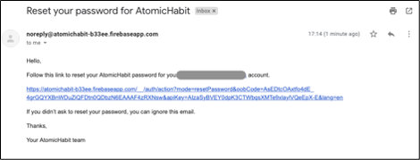

# SwiftUI - Atomic Habits
<br />

Atomic Habit is an iOS application which provide user to develop their habit effortless with worldwide. 
Users can create the habit they want to form and track it down and have ability to view the other user’s habit then leave the comment on the community.

## Promote Video & Explaination of Project
1. [Promotion Video](https://youtu.be/KxArU_eSOBw)
1. [Presentation of Projdect](https://youtu.be/E3dGqUlnLaI)

## Features

- [x] Implement Onboarding Screens
- [x] Signup/Login Screen by using Firebase Authentication 
- [x] Register account with AppleID & E-mail
- [x] Schedule & Edit the habit
- [x] Select habit from the presets
- [x] Allow user to leave the comment on the certain habits
- [x] Network Handler while user offline
- [x] Analyze Screen

You can find the [Help Systems and Tutorials](https://github.com/tsaihong1995/AtomicHabits/blob/develop/Help%20Systems%20and%20Tutorials.pdf) at here.

1. Onboarding Screen
 

2. Home Screen

| Home Screen | Home Screen 2 |
| ------------- | ------------- |
|  |  |

3. RegisterScreen

| Register Screen | Error Handling |
| ------------- | ------------- | 
|  |  |

4. Forget Password

| Forgetten Password | Forgetten Password Email |
| ------------- | ------------- | 
|  |  |

5. Habit Detail
 
 
6. Add Habits
 

## Requirements

- iOS 13.0+
- SwiftUI


## Dependencies

This project use following framework

```swift
  # Pods for AtomicHabit
  pod 'Firebase/Analytics'
  pod 'Firebase/Auth'
  pod 'Firebase/Firestore'
  pod 'FirebaseFirestoreSwift'
```


## Installation

Clone the project and run in your local workstation. 


## Acknowledgements
- This application is created by following people:

1. Hung Chun, Tsai 
2. Sandeep Vithal Rao Adode
3. Priyanka Venkata Naga Sai Siriki


## Contact
Created by [@Hung-Chun, Tsai (Carter)](linkedin.com/in/hung-chun-carter-tsai-372584175) - feel free to contact me!

<div>

<i>Follow me around the web:</i><br>

<!-- <a target="_blank" href="https://www.linkedin.com/in/hung-chun-carter-tsai-372584175/">🇱​🇮​🇳​🇰​🇪​🇩​🇮​🇳​</a> ●
<a target="_blank" href="https://www.instagram.com/hungchun.tsai/">🇮​🇳​🇸​🇹​🇦​🇬​🇷​🇦​🇲​</a> ●
<a target="_blank" href="https://www.facebook.com/hongjun.cai.5">🇫​🇦​🇨​🇪​🇧​🇴​🇴​🇰​</a> ● -->

<a href="https://www.linkedin.com/in/hung-chun-carter-tsai-372584175/" target="_blank"></a>
<a href="https://www.instagram.com/hungchun.tsai/" target="_blank"></a>
<a href="https://www.facebook.com/hongjun.cai.5" target="_blank"></a>

</div>
